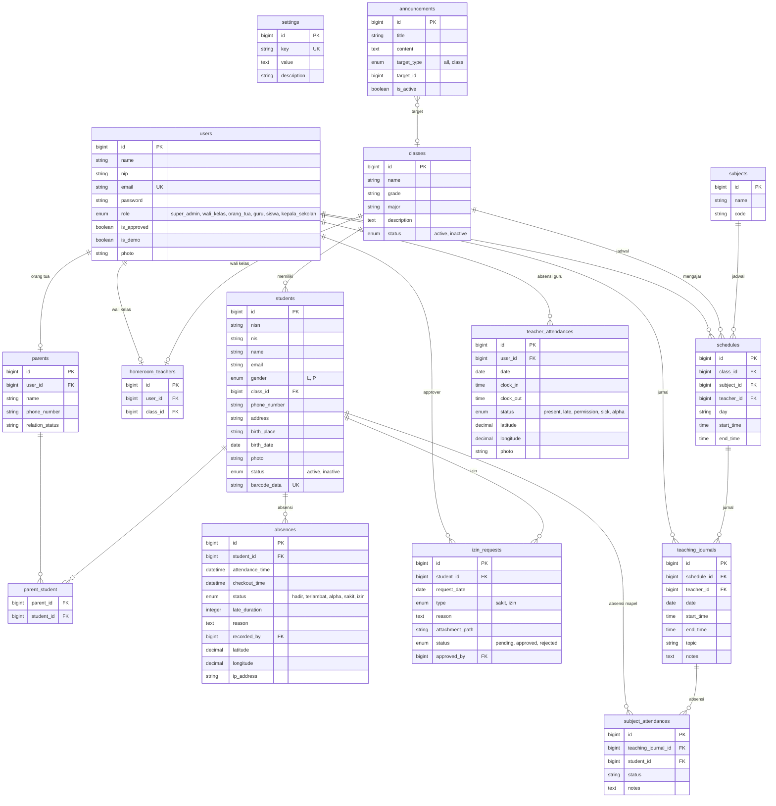

# 🏫 E-Absensi Siswa

**E-Absensi Siswa** adalah aplikasi berbasis web modern untuk manajemen presensi siswa sekolah yang efisien, transparan, dan real-time. Aplikasi ini memanfaatkan QR Code untuk mempercepat proses absensi, serta fitur notifikasi WhatsApp otomatis kepada orang tua, dan rekap laporan kehadiran yang komprehensif.

## 🚀 Fitur Unggulan

-   **✨ Landing Page Modern (SaaS Style)**: Tampilan depan profesional, responsif, dan elegan dengan tema Dark/Gradient serta animasi halus. Informasi sekolah (Footer/Hero) dinamis mengikuti pengaturan aplikasi.
-   **📥 Import Data Guru via Excel**: Fitur import masal data guru kini mendukung file **Excel (.xlsx)** yang lebih mudah diedit dibanding CSV. Dilengkapi panduan pengisian dan validasi data otomatis.
-   **📱 Scan QR Code Cepat**: Absensi siswa dilakukan hanya dalam hitungan detik dengan memindai Kartu Pelajar ber-QR Code menggunakan kamera laptop/PC sekolah.
-   **💬 Notifikasi WhatsApp Gateway**: Orang tua otomatis menerima pesan WhatsApp saat anak melakukan absensi Masuk dan Pulang (Real-time).
-   **📄 Laporan PDF Otomatis**: Guru/Admin dapat mengunduh rekap absensi harian, bulanan, hingga semester dalam format PDF siap cetak.
-   **👥 Manajemen Pengguna & Hak Akses**:
    -   **Admin**: Akses penuh ke seluruh sistem, manajemen data master (Siswa, Guru, Kelas, Jurusan), dan setting sekolah.
    -   **Wali Kelas**: Memantau kehadiran siswa di kelasnya, mencetak laporan, dan mengelola izin/sakit.
    -   **Operator/Guru Piket**: Khusus untuk melakukan scanning absensi harian.
-   **📊 Dashboard Informatif**: Statistik kehadiran harian ditampilkan dalam grafik dan angka yang mudah dipahami.
-   **🎨 UI/UX Responsif**: Dibangun dengan Tailwind CSS dan Alpine.js untuk pengalaman pengguna yang mulus di perangkat desktop maupun mobile.
-   **🔧 Pengaturan Sekolah Dinamis**: Logo sekolah, nama sekolah, kepala sekolah, alamat, dan sosial media dapat diatur langsung dari menu Settings tanpa menyentuh kodingan.

## 🛠️ Teknologi yang Digunakan

Aplikasi ini dibangun menggunakan stack teknologi modern untuk performa dan kemudahan pengembangan:

-   **Backend**: [Laravel 12](https://laravel.com) (PHP Entity Framework)
-   **Frontend**:
    -   [Tailwind CSS](https://tailwindcss.com) (Styling)
    -   [Alpine.js](https://alpinejs.dev) (Interaktivitas Ringan)
    -   [Blade Templates](https://laravel.com/docs/blade)
-   **Database**: MySQL
-   **Authentication**: Laravel Breeze
-   **Library Pendukung**:
    -   `maatwebsite/excel`: Untuk export/import data Excel.
    -   `barryvdh/laravel-dompdf`: Untuk generate laporan PDF.
    -   `simplesoftwareio/simple-qrcode`: Untuk generate QR Code siswa.
    -   `aos`: Animate On Scroll untuk efek visual landing page.
    -   `chart.js`: Untuk grafik statistik di dashboard.

## 📊 Entity Relationship Diagram (ERD)

Berikut adalah diagram relasi antar tabel dalam database **E-Absensi Siswa**:



### Ringkasan Tabel

| Domain | Tabel | Keterangan |
|--------|-------|------------|
| **Auth** | `users` | Semua pengguna (6 role) |
| **Akademik** | `classes`, `students`, `subjects`, `schedules` | Data master sekolah |
| **Absensi Siswa** | `absences`, `izin_requests`, `subject_attendances` | Kehadiran harian & per mapel |
| **Absensi Guru** | `teacher_attendances` | Clock-in/out guru dengan GPS |
| **Wali Kelas** | `homeroom_teachers` | Pivot user ↔ kelas |
| **Orang Tua** | `parents`, `parent_student` | Data ortu & relasi M:N ke siswa |
| **Mengajar** | `teaching_journals` | Jurnal harian guru |
| **Lainnya** | `announcements`, `settings` | Pengumuman & konfigurasi |

## ⚙️ Persyaratan Sistem

Pastikan server Anda memenuhi persyaratan berikut:

-   PHP >= 8.3
-   Composer
-   MySQL / MariaDB
-   Node.js & NPM (untuk compile asset)

## 📥 Cara Instalasi

Ikuti langkah-langkah berikut untuk menjalankan aplikasi di lokal (Localhost):

1.  **Clone Repository**
    ```bash
    git clone https://github.com/username/e-absensi-siswa.git
    cd e-absensi-siswa
    ```

2.  **Install Dependencies**
    ```bash
    composer install
    npm install
    ```

3.  **Konfigurasi Environment**
    Salin file `.env.example` menjadi `.env` dan atur koneksi database Anda.
    ```bash
    cp .env.example .env
    ```
    Buka file `.env` dan sesuaikan DB_DATABASE, DB_USERNAME, dan DB_PASSWORD.

4.  **Generate App Key**
    ```bash
    php artisan key:generate
    ```

5.  **Migrasi & Seeding Database**
    Jalankan perintah ini untuk membuat tabel dan mengisi data awal (Akun Admin Default).
    ```bash
    php artisan migrate --seed
    ```

6.  **Jalankan Server**
    Buka dua terminal terpisah untuk menjalankan server Laravel dan Vite (Asset Bundling).
    
    *Terminal 1:*
    ```bash
    php artisan serve
    ```
    
    *Terminal 2:*
    ```bash
    npm run dev
    ```

7.  **Akses Aplikasi**
    Buka browser dan kunjungi `http://localhost:8000`.

## 🔐 Akun Default (Seeder)

Jika menggunakan `db:seed`, Anda bisa login dengan akun berikut:

-   **Admin**
    -   Email: `admin@admin.com`
    -   Password: `password`

## 🤝 Kontribusi

Kontribusi selalu terbuka! Jika Anda ingin memperbaiki bug atau menambahkan fitur, silakan buat Pull Request.

## 📄 Lisensi

Aplikasi ini bersifat open-source di bawah lisensi [MIT](https://opensource.org/licenses/MIT).
