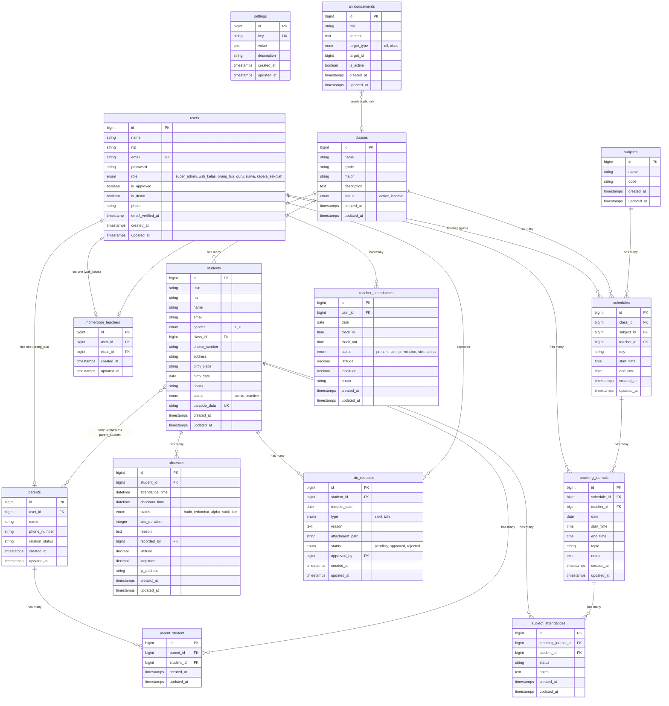

# 📊 ERD - E-Absensi Siswa

Dokumentasi lengkap Entity Relationship Diagram project **E-Absensi Siswa**.

## Diagram ERD

---

## 📋 Detail Tabel & Relasi

### 1. 👤 `users` — Pengguna Sistem
Tabel utama autentikasi. Menyimpan semua jenis pengguna.

| Kolom | Tipe | Keterangan |
|-------|------|------------|
| `id` | bigint | Primary Key |
| `name` | string | Nama lengkap |
| `nip` | string | Nomor Induk Pegawai (untuk guru/staff) |
| `email` | string | Email (unique) |
| `password` | string | Password terenkripsi |
| `role` | enum | `super_admin`, `wali_kelas`, `orang_tua`, `guru`, `siswa`, `kepala_sekolah` |
| `is_approved` | boolean | Status persetujuan akun |
| `is_demo` | boolean | Flag akun demo |
| `photo` | string | Path foto profil |

**Relasi:**
- `1:1` → `homeroom_teachers` (jika role = wali_kelas)
- `1:1` → `parents` (jika role = orang_tua)
- `1:N` → `schedules` (sebagai guru pengajar)
- `1:N` → `teacher_attendances` (absensi guru)
- `1:N` → `teaching_journals` (jurnal mengajar)
- `1:N` → `izin_requests` (sebagai approver)

---

### 2. 🏫 `classes` — Kelas
| Kolom | Tipe | Keterangan |
|-------|------|------------|
| `id` | bigint | Primary Key |
| `name` | string | Nama kelas (mis: "X-IPA-1") |
| `grade` | string | Tingkat kelas |
| `major` | string | Jurusan |
| `description` | text | Deskripsi kelas |
| `status` | enum | `active` / `inactive` |

**Relasi:**
- `1:N` → `students` (siswa dalam kelas)
- `1:1` → `homeroom_teachers` (wali kelas)
- `1:N` → `schedules` (jadwal pelajaran)
- `1:N` ← `announcements` (target pengumuman)

---

### 3. 🎓 `students` — Siswa
| Kolom | Tipe | Keterangan |
|-------|------|------------|
| `id` | bigint | Primary Key |
| `nisn` | string | Nomor Induk Siswa Nasional |
| `nis` | string | Nomor Induk Siswa (lokal) |
| `name` | string | Nama lengkap |
| `email` | string | Email siswa |
| `gender` | enum | `L` (Laki-laki) / `P` (Perempuan) |
| `class_id` | FK | → `classes.id` |
| `phone_number` | string | Nomor HP |
| `address` | string | Alamat |
| `birth_place` | string | Tempat lahir |
| `birth_date` | date | Tanggal lahir |
| `photo` | string | Path foto |
| `status` | enum | `active` / `inactive` |
| `barcode_data` | string | UUID unik untuk barcode (auto-generated) |

**Relasi:**
- `N:1` → `classes` (kelas)
- `1:N` → `absences` (data absensi harian)
- `1:N` → `izin_requests` (pengajuan izin)
- `M:N` ↔ `parents` (via `parent_student`)
- `1:N` → `subject_attendances` (absensi per mata pelajaran)

---

### 4. 👨‍🏫 `homeroom_teachers` — Wali Kelas (Pivot)
Menghubungkan user (wali kelas) dengan kelas yang diampu.

| Kolom | Tipe | Keterangan |
|-------|------|------------|
| `id` | bigint | Primary Key |
| `user_id` | FK | → `users.id` |
| `class_id` | FK | → `classes.id` (nullable) |

---

### 5. 👪 `parents` — Orang Tua
| Kolom | Tipe | Keterangan |
|-------|------|------------|
| `id` | bigint | Primary Key |
| `user_id` | FK | → `users.id` |
| `name` | string | Nama orang tua |
| `phone_number` | string | Nomor HP (nullable) |
| `relation_status` | string | Status hubungan (Ayah/Ibu/Wali) |

**Relasi:**
- `N:1` → `users` (akun login)
- `M:N` ↔ `students` (via `parent_student`)

---

### 6. 🔗 `parent_student` — Pivot Orang Tua ↔ Siswa
Tabel pivot Many-to-Many antara `parents` dan `students`.

| Kolom | Tipe | Keterangan |
|-------|------|------------|
| `parent_id` | FK | → `parents.id` |
| `student_id` | FK | → `students.id` |

---

### 7. ✅ `absences` — Absensi Harian Siswa
| Kolom | Tipe | Keterangan |
|-------|------|------------|
| `id` | bigint | Primary Key |
| `student_id` | FK | → `students.id` |
| `attendance_time` | datetime | Waktu check-in |
| `checkout_time` | datetime | Waktu check-out (pulang) |
| `status` | enum | `hadir`, `terlambat`, `alpha`, `sakit`, `izin` |
| `late_duration` | integer | Durasi terlambat (menit) |
| `reason` | text | Alasan (jika sakit/izin/alpha) |
| `recorded_by` | FK | → `users.id` (pencatat) |
| `latitude` | decimal | Koordinat GPS |
| `longitude` | decimal | Koordinat GPS |
| `ip_address` | string | IP address perangkat |

---

### 8. 📝 `izin_requests` — Pengajuan Izin/Sakit
| Kolom | Tipe | Keterangan |
|-------|------|------------|
| `id` | bigint | Primary Key |
| `student_id` | FK | → `students.id` |
| `request_date` | date | Tanggal pengajuan |
| `type` | enum | `sakit` / `izin` |
| `reason` | text | Alasan izin |
| `attachment_path` | string | Path lampiran (surat dokter, dll) |
| `status` | enum | `pending`, `approved`, `rejected` |
| `approved_by` | FK | → `users.id` |

---

### 9. ⚙️ `settings` — Pengaturan Sekolah
Key-value store untuk konfigurasi aplikasi.

| Kolom | Tipe | Keterangan |
|-------|------|------------|
| `key` | string | Kunci setting (unique) |
| `value` | text | Nilai setting |
| `description` | string | Deskripsi setting |

---

### 10. 📢 `announcements` — Pengumuman
| Kolom | Tipe | Keterangan |
|-------|------|------------|
| `id` | bigint | Primary Key |
| `title` | string | Judul pengumuman |
| `content` | text | Isi pengumuman |
| `target_type` | enum | `all` (semua) / `class` (kelas tertentu) |
| `target_id` | bigint | → `classes.id` (jika target_type = class) |
| `is_active` | boolean | Status aktif/tidak |

---

### 11. 📚 `subjects` — Mata Pelajaran
| Kolom | Tipe | Keterangan |
|-------|------|------------|
| `id` | bigint | Primary Key |
| `name` | string | Nama mata pelajaran |
| `code` | string | Kode mata pelajaran |

---

### 12. 📅 `schedules` — Jadwal Pelajaran
| Kolom | Tipe | Keterangan |
|-------|------|------------|
| `id` | bigint | Primary Key |
| `class_id` | FK | → `classes.id` |
| `subject_id` | FK | → `subjects.id` |
| `teacher_id` | FK | → `users.id` (guru) |
| `day` | string | Hari (Senin, Selasa, dst) |
| `start_time` | time | Jam mulai |
| `end_time` | time | Jam selesai |

---

### 13. 📓 `teaching_journals` — Jurnal Mengajar
| Kolom | Tipe | Keterangan |
|-------|------|------------|
| `id` | bigint | Primary Key |
| `schedule_id` | FK | → `schedules.id` |
| `teacher_id` | FK | → `users.id` |
| `date` | date | Tanggal mengajar |
| `start_time` | time | Jam mulai aktual |
| `end_time` | time | Jam selesai aktual |
| `topic` | string | Topik/materi yang diajarkan |
| `notes` | text | Catatan guru |

**Relasi:**
- `1:N` → `subject_attendances` (absensi siswa per sesi)

---

### 14. 📋 `subject_attendances` — Absensi Per Mata Pelajaran
| Kolom | Tipe | Keterangan |
|-------|------|------------|
| `id` | bigint | Primary Key |
| `teaching_journal_id` | FK | → `teaching_journals.id` |
| `student_id` | FK | → `students.id` |
| `status` | string | Status kehadiran |
| `notes` | text | Catatan |

---

### 15. 🕐 `teacher_attendances` — Absensi Guru/Staff
| Kolom | Tipe | Keterangan |
|-------|------|------------|
| `id` | bigint | Primary Key |
| `user_id` | FK | → `users.id` |
| `date` | date | Tanggal |
| `clock_in` | time | Jam masuk |
| `clock_out` | time | Jam pulang |
| `status` | enum | `present`, `late`, `permission`, `sick`, `alpha` |
| `latitude` | decimal | Koordinat GPS |
| `longitude` | decimal | Koordinat GPS |
| `photo` | string | Foto selfie saat absen |

---

## 🔄 Ringkasan Jenis Relasi

| Relasi | Tipe | Via |
|--------|------|-----|
| User ↔ HomeroomTeacher | One-to-One | `user_id` |
| User ↔ Parent | One-to-One | `user_id` |
| User → Schedule | One-to-Many | `teacher_id` |
| User → TeacherAttendance | One-to-Many | `user_id` |
| User → TeachingJournal | One-to-Many | `teacher_id` |
| Class → Student | One-to-Many | `class_id` |
| Class ↔ HomeroomTeacher | One-to-One | `class_id` |
| Class → Schedule | One-to-Many | `class_id` |
| Student → Absence | One-to-Many | `student_id` |
| Student → IzinRequest | One-to-Many | `student_id` |
| Student ↔ Parent | **Many-to-Many** | `parent_student` pivot |
| Student → SubjectAttendance | One-to-Many | `student_id` |
| Subject → Schedule | One-to-Many | `subject_id` |
| Schedule → TeachingJournal | One-to-Many | `schedule_id` |
| TeachingJournal → SubjectAttendance | One-to-Many | `teaching_journal_id` |

> **Total: 15 tabel, 15 relasi utama**
